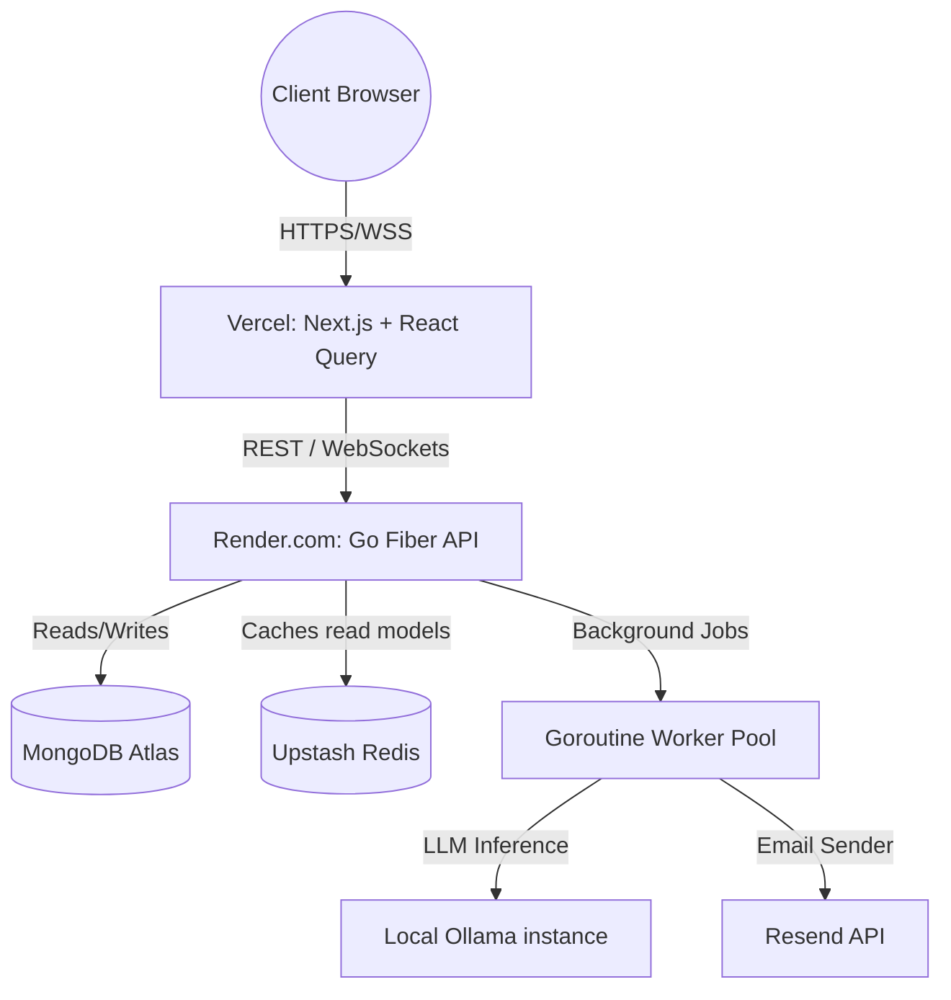

# Custom Form Builder with Live Analytics

A modern, full-stack form builder application featuring drag-and-drop form creation, conditional logic, real-time analytics dashboard, and AI-powered insights using Ollama.

## ✨ Features

- **Drag & Drop Form Builder**: Intuitive visual form creation with real-time preview
- **Conditional Logic**: Advanced branching and conditional field display
- **Multiple Field Types**: Text, rating, multiple choice, checkboxes, and more
- **Real-time Analytics**: Live dashboard with WebSocket-powered updates
- **AI Insights**: Ollama-powered analytics and recommendations
- **Responsive Design**: Mobile-first design with dark theme
- **Form Publishing**: Share forms with unique slugs
- **Data Export**: JSON-based form responses
- **WebSocket Integration**: Real-time form response tracking

## 🏗 System Architecture



## 🛠 Tech Stack

### Frontend
- **Next.js 16** - React framework with App Router
- **React 19** - UI library
- **TypeScript** - Type safety
- **Tailwind CSS** - Styling
- **React Query** - Data fetching and caching
- **Framer Motion** - Animations
- **Lucide React** - Icons
- **shadcn/ui** - Component library

### Backend
- **Go Fiber** - Web framework
- **MongoDB** - Primary database
- **Redis** - Caching and real-time data
- **WebSockets** - Real-time communication
- **Ollama** - Local AI inference

### DevOps
- **Docker** - Containerization
- **Vercel** - Frontend deployment
- **Render** - Backend deployment
- **GitHub Actions** - CI/CD

## 🔗 Live Demos

**Frontend**: https://custom-form-builder-with-live-analy-nine.vercel.app/ 
**Backend API**: https://custom-form-builder-with-live-analytics-x03z.onrender.com/healthz  
**API Documentation**: [Swagger UI](https://custom-form-builder-with-live-analytics-x03z.onrender.com/docs)

## 🚀 Quick Start

### Prerequisites

- Docker and Docker Compose
- Node.js 18+ (for local frontend development)
- Go 1.21+ (for local backend development)
- MongoDB Atlas account
- Upstash Redis account
- Resend API key (for emails)

### Local Development

1. **Clone the repository**
   ```bash
   git clone https://github.com/kulkarni1973onkar/Custom_Form_Builder_with_Live_Analytics.git
   cd Custom_Form_Builder_with_Live_Analytics
   ```

2. **Environment Setup**
   ```bash
   # Copy environment files
   cp .env.example .env
   cp backend/.env.example backend/.env

   # Configure your API keys in both .env files
   # Required: MONGO_URI, REDIS_URL, RESEND_API_KEY, JWT_SECRET
   ```

3. **Start with Docker Compose**
   ```bash
   docker-compose up --build
   ```

   

### Manual Setup (Alternative)

1. **Backend Setup**
   ```bash
   cd backend
   go mod download
   go run main.go
   ```

2. **Frontend Setup**
   ```bash
   cd frontend
   npm install
   npm run dev
   ```

## 🧪 Testing & Seeding

### Pre-seed Test Data
```bash
cd backend
go run scripts/seed.go
```

### Run Tests
```bash
# Backend tests
cd backend
go test ./...

# Frontend tests (if implemented)
cd frontend
npm test
```

## 📦 Deployment

### Frontend (Vercel)
1. Connect your GitHub repo to Vercel
2. Set environment variables in Vercel dashboard:
   - `NEXT_PUBLIC_API_BASE`: `https://custom-form-builder-with-live-analytics-x03z.onrender.com`
3. Deploy automatically on push to main branch

### Backend (Render)
1. Use the provided `render.yaml` for deployment
2. Set environment variables in Render dashboard
3. Deploy from your GitHub repo

## 📖 Usage

### Creating a Form
1. Navigate to `/forms/new`
2. Drag and drop fields from the sidebar
3. Configure field properties and conditional logic
4. Save and publish your form

### Viewing Analytics
1. Go to `/analytics/{form-id}`
2. View real-time response data
3. Use the Ollama panel for AI insights

### Public Form Access
- Share forms via `/public/{slug}` URLs
- Responses are automatically tracked

## 🤝 Contributing

1. Fork the repository
2. Create a feature branch: `git checkout -b feature/amazing-feature`
3. Commit changes: `git commit -m 'Add amazing feature'`
4. Push to branch: `git push origin feature/amazing-feature`
5. Open a Pull Request

### Development Guidelines
- Follow Go and TypeScript best practices
- Write tests for new features
- Update documentation
- Use conventional commits

## 📄 License

This project is licensed under the MIT License - see the [LICENSE](LICENSE) file for details.

## 🙏 Acknowledgments

- [shadcn/ui](https://ui.shadcn.com/) for the component library
- [Go Fiber](https://gofiber.io/) for the backend framework
- [Ollama](https://ollama.ai/) for local AI capabilities
- [Vercel](https://vercel.com/) and [Render](https://render.com/) for hosting

---

Built with Next.js, Go Fiber, and modern web technologies.
